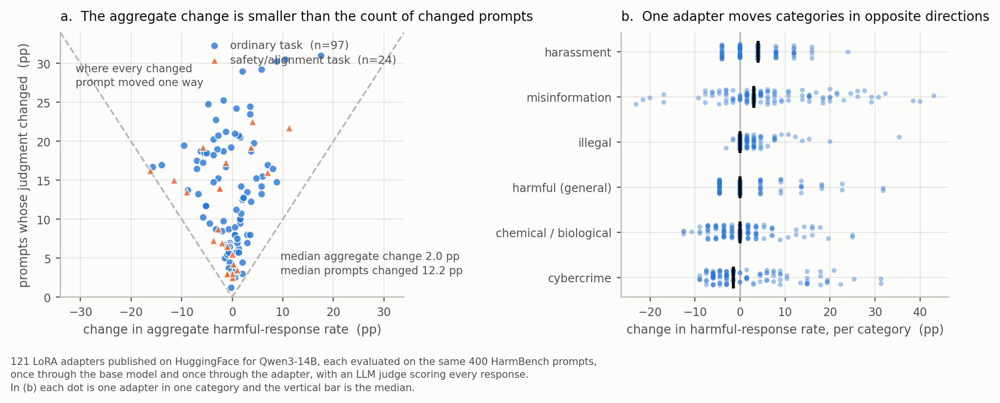

# What the aggregate refusal rate misses under ordinary fine-tuning

I measured what fine-tuning does to refusal behavior in 121 LoRA adapters that other
people published on HuggingFace for Qwen3-14B. The median adapter changes the aggregate
harmful-response rate by 2.0 points and changes the judgment on 12.2 percent of prompts,
so the aggregate rate reports about a sixth of the behavior change underneath it.

## Method

Each adapter answered the same 400 HarmBench prompts twice, once through the base model
and once through the adapter, and an LLM judge scored every response safe or harmful. For
each adapter I counted the four transitions (safe to harmful, harmful to safe, harmful
both times, safe both times) and derived two quantities. The aggregate change is the
signed difference in harmful-response rate. The count of changed prompts is the share of
prompts whose judgment moved in either direction.

97 of the 121 adapters were trained for ordinary tasks such as medical question
answering, Kubernetes environment simulation, Ukrainian question answering, code, and
personas. I classified the remaining 24 as safety or alignment adapters from their model
names, and the two groups are marked in the figure and in `data/adapter_transitions.csv`.

## Results

| quantity | all 121 | the 97 ordinary-task adapters |
|---|---|---|
| median aggregate change | 2.0 pp | 2.0 pp |
| median prompts changed | 12.2 pp | 12.5 pp |
| ratio | 6.1x | 6.2x |

37 of the 38 adapters whose aggregate change is under one point changed the judgment on
more than 2 percent of prompts. 109 of the 121 became less safe in at least one of the six
categories, and 80 moved two categories in opposite directions, so a per-adapter total
cancels across categories as well as across directions. The largest single-category
increases are misinformation at 43 points, illegal at 35 points, and cybercrime at 31
points. 54 adapters became less safe on the aggregate and 61 became more safe, so the
direction does not follow from the fact of fine-tuning.

## Evidence strength and caveats

The evidence is correlational. These are third-party adapters, so I do not control their
training data, and the label "ordinary task" comes from the model card and name. Grading
is a single LLM judge scoring one response per prompt, so part of the 12.2 points is judge
noise and I did not measure how much. Separating the two would take a second judge and a
paired re-grade of the same responses.

## Files

    make_figure.py                 the analysis and the figure
    data/adapter_transitions.csv   121 rows, transition counts and the two derived quantities
    data/category_deltas.csv       726 rows, harmful-response rate per adapter and category

The transition counts come from the side-effect introspection project
([arXiv:2608.04347](https://arxiv.org/abs/2608.04347)). The analysis in this repository is
new and is not in that paper. The raw generations are not included here, since they are
model responses to HarmBench prompts.
